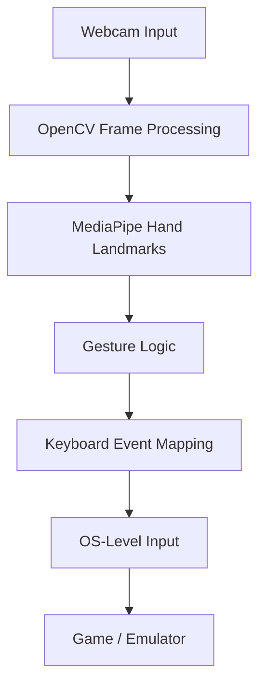

<!-- Gesture-Controlled Game Interface README -->

  

  
  
  
  

---

## 🎥 Project Demo & Video Walkthrough (Start Here)

  

  <i>Complete walkthrough explaining system design, gesture logic, and real-time interaction pipeline.</i>

---

## 🚀 Overview

This project implements a **real-time gesture-controlled gaming interface** using **computer vision and human–computer interaction (HCI)** principles.

Hand gestures captured through a webcam are processed live and translated into **system-level keyboard inputs**, enabling **hands-free control of a game** running inside an Android emulator.

The goal was not just gesture detection, but building a **robust end-to-end interaction pipeline** that connects vision, decision logic, and OS-level control in real time.

---

## 🧠 System Pipeline (High-Level)

Camera Input
   ↓
Hand Landmark Detection
   ↓
Gesture Classification
   ↓
Keyboard Event Mapping
   ↓
OS-Level Input Injection
   ↓
Game / Emulator Control
This pipeline is designed to be modular, extensible, and hardware-aware, making it suitable for experimentation with other applications beyond gaming.

## ✨ Key Features
Feature	Description
✋ Real-Time Hand Tracking	Tracks hand landmarks live using MediaPipe via CVZone
🎯 Gesture-Based Control	Interprets finger states (open palm, fist) into actions
⌨️ System-Level Input	Injects keyboard events using Python (pynput)
🎮 External App Integration	Controls a game running in an Android emulator
⚡ Low Latency Pipeline	Designed for smooth real-time interaction
🧪 Experiment-Friendly	Easy to extend with new gestures or applications

## 🧰 Tech Stack

  

## 🧰 Core Technologies

- **Python 3.10**
- **OpenCV** – video capture and frame processing
- **MediaPipe** – hand landmark detection
- **CVZone** – abstraction over MediaPipe for gesture handling
- **pynput** – OS-level keyboard event simulation

---

## 🧭 System Architecture

    
## 🚀 Getting Started

1️⃣ Clone the Repository
bash
Copy code
git clone https://github.com/YOUR_USERNAME/gesture-controlled-game-interface.git
cd gesture-controlled-game-interface

2️⃣ Create Virtual Environment
bash
Copy code
python -m venv venv
venv\Scripts\Activate   # Windows 

3️⃣ Install Dependencies
bash
Copy code
pip install -r requirements.txt

4️⃣ Run the Project
bash
Copy code
python gesture_control_hill_climb.py

⚠️ Make sure the game/emulator window is in focus while running the script.

## 🧪 Gesture Mapping (Current)

Gesture	Action 

✊ Fist	Move Left 🖐 Open Palm	Move Right

Other / No Hand	Neutral

## 👩‍💻 Author
Priyanka Asthana

🎓 B.Tech (Hons) CSE | Minor in Robotics

📍 India

